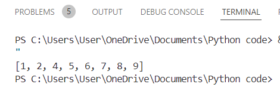
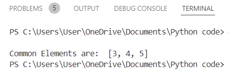
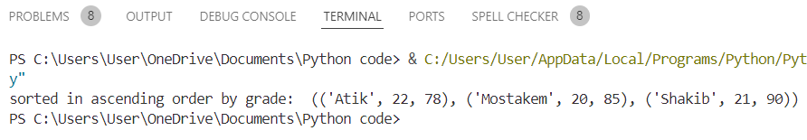
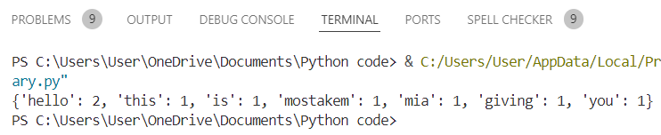
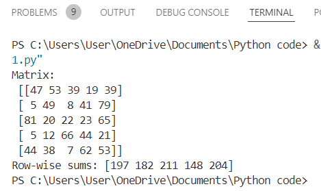
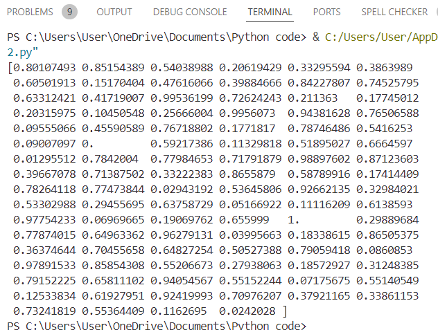
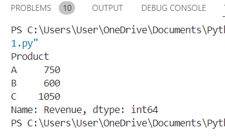
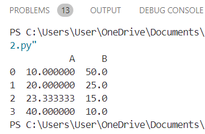
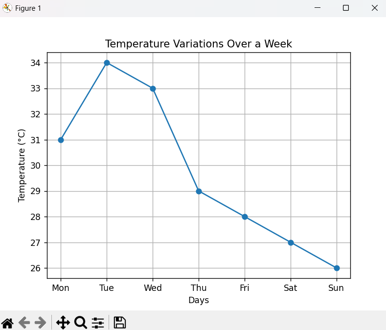
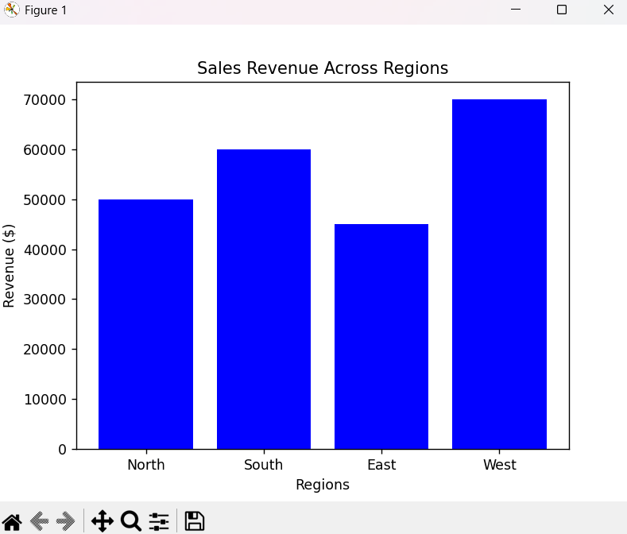

<h1>CLP-02<h1>

<h2>Code Description and Output</h2>

<h2 id="list-duplicates">1. List: Remove Duplicates and Sort in Ascending Order</h2>

This program takes a list of numbers, removes any duplicate values, and sorts them in ascending order. 
It ensures that each number appears only once and organizes them in increasing order.

<strong>Example Input:</strong>

<pre>list: [1,4,5,2,5,2,1,7,6,5,8,8,9]</pre>

<strong>Example Output:</strong>

 <pre></pre>

<h2 id="set-common-elements">2. Set: Find Common Elements Between Two Lists</h2>

This program identifies the common numbers between two lists using Python sets. 
It efficiently finds shared values between two datasets.

<strong>Example Input:</strong>

<pre>list1: [1, 2, 3, 4, 5]
list2: [3, 4, 5, 6, 7]</pre>

<strong>Example Output:</strong>

 <pre></pre>

<h2 id="tuple-student-grades">3. Tuple: Sort Student Records by Grade</h2>

This program stores student records as tuples and sorts them based on grades in ascending order.

<strong>Example Input:</strong>

<pre>students: [("Mostakem", 20, 85), ("Atik", 22, 78), ("Shakib", 21, 90)]</pre>

<strong>Example Output:</strong>

 <pre></pre>

<h2 id="dictionary-word-count">4. Dictionary: Count Word Occurrences</h2>

This program counts the occurrences of each word in a given text and stores the counts in a dictionary.

<strong>Example Input:</strong>

<pre>text: "hello this is mostakem mia giving you hello"</pre>
 <pre></pre>

<h2 id="numpy-matrix-sum">5. NumPy: Generate a 5x5 Matrix and Compute Row-wise Sums</h2>

This program generates a 5x5 matrix with random numbers and computes the sum of each row separately.

<strong>Example Output:</strong>

 <pre></pre>

<h2 id="numpy-normalize">6. NumPy: Normalize an Array of 100 Random Values</h2>

This program generates 100 random values and normalizes them between 0 and 1 using min-max normalization.

<strong>Example Output:</strong>

 <pre></pre>

<h2 id="pandas-total-revenue">7. Pandas: Compute Total Revenue per Product</h2>

This program reads sales data from a CSV file, groups the revenue by product type, and computes the total revenue.

<strong>Example CSV Input:</strong>

<pre>Product,Revenue
A,100
B,200
A,150
C,300
B,250
C,400
A,200
B,150
C,350
A,300</pre>

<strong>Example Output:</strong>

 <pre></pre>

<h2 id="pandas-missing-values">8. Pandas: Fill Missing Values with Column-wise Means</h2>

This program fills missing values (None) in a dataset by replacing them with the mean of their respective columns.

<strong>Example Input:</strong>

<pre> A     B
10    50
20   None
None  15
40    10</pre>

<strong>Example Output:</strong>

 <pre></pre>

<h2 id="matplotlib-line-graph">9. Matplotlib: Line Graph of Temperature Variations Over a Week</h2>

This program plots a line graph that visualizes temperature changes throughout the week, showing fluctuations and trends over time.

<strong>Example Input:</strong>

<pre>days = ["Mon", "Tue", "Wed", "Thu", "Fri", "Sat", "Sun"]
temps = [31, 34, 33, 29, 28, 27, 26]</pre>

<strong>Example Output:</strong>

 <pre></pre>

<h2 id="matplotlib-bar-chart">10. Matplotlib: Bar Chart Comparing Sales Revenue Across Regions</h2>

This program creates a bar chart comparing sales revenue in different regions.

<strong>Example Input:</strong>

<pre>regions = ["North", "South", "East", "West"]
revenues = [50000, 60000, 45000, 70000]</pre>

<strong>Example Output:</strong>

 <pre></pre>

