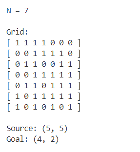
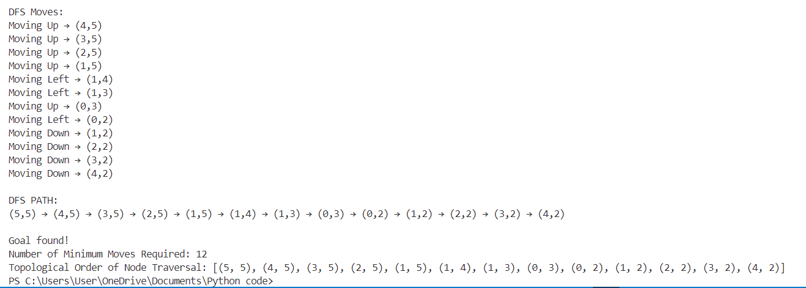

<h1>Lab Report-01<h1>

<h2>Code Description and Output</h2>

<h2 id="list-duplicates">PROBLEM: Write a program that generates a random N×N grid (N between 4 and 7) with non-obstacle source and goal states. It performs DFS to find a path from source to goal and prints the grid, source, goal, DFS path, and topological order of node traversal.</h2>

This program generates a random 𝑁×𝑁 grid (where 𝑁 is between 4 and 7) consisting of open spaces (1s) and obstacles (0s). It then selects a random source and goal position, ensuring they are placed in open spaces. The program employs a Depth-First Search (DFS) algorithm to find a path from the source to the goal while keeping track of the traversal order.

<strong>Key Features:</strong>

<li><strong>Grid Generation:</strong></li>
<ol>1. The program randomly selects 𝑁 between 4 and 7.</ol>
<ol>2. It creates an N×N grid with values of either 1 (open space) or 0 (obstacle).</ol>
<ol>3. The source and goal positions are chosen randomly from valid open spaces.</ol>
<li><strong>Depth-First Search (DFS) Algorithm:</strong></li>
<ol>1. DFS is used to explore the grid, starting from the source position.</ol>
<ol>2. The program follows four possible movement directions: up, down, left, and right.</ol>
<ol>3. A recursive DFS function is implemented to traverse the grid while avoiding obstacles and backtracking when necessary.</ol>
<li><strong>Path Tracking and Topological Order:</strong></li>
<ol>1. The program records every move in the DFS traversal.</ol>
<ol>2. If the goal is reached, the program prints the path from the source to the goal.</ol>
<ol>3. It also records the topological order of the nodes visited during the traversal.</ol>
<li><strong>Output Details:</strong></li>
<ol>1. The program displays the generated grid.</ol>
<ol>2. It prints the randomly chosen source and goal positions.</ol>
<ol>3. If a valid path is found, it prints the sequence of moves taken, the number of moves required to reach the goal and prints topological order.</ol>

<strong>Example Randomly Generated Input:</strong>

<pre></pre>

<strong>Example Output:</strong>

 <pre></pre>
